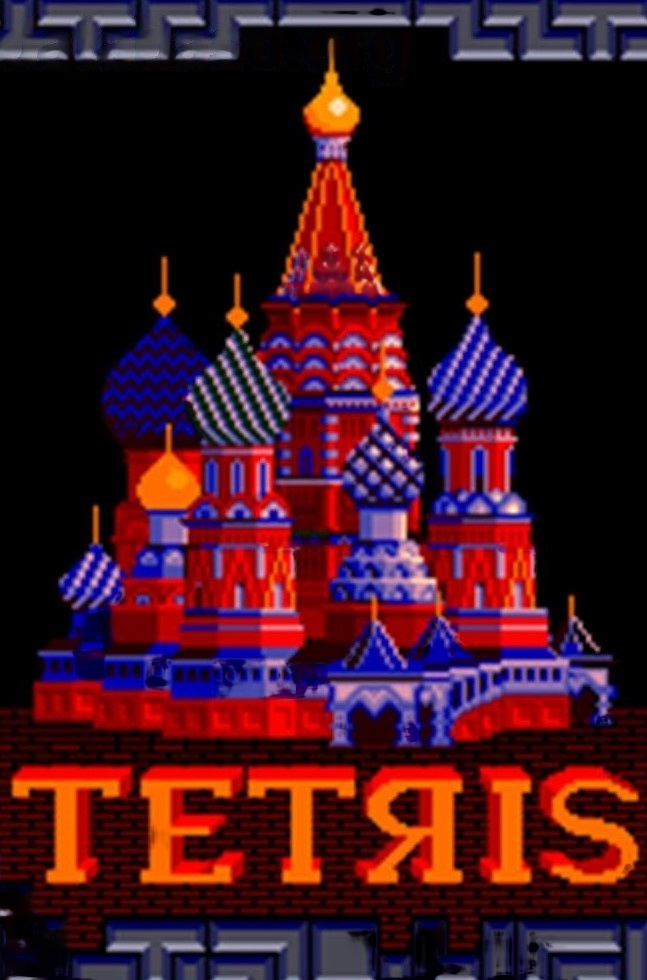

# Java Tetris Project

This repository contains a Java based Tetris game created with a focus on clarity, structure, and a touch of wholesome nostalgia. It brings the classic falling block experience to life using a clean model view architecture that keeps the code easy to read, maintain, and extend.

  

## Skills Demonstrated

* Solid object oriented design in Java
* Clear separation between game logic, rendering, and state management
* Event driven updates and timing control
* Collision detection and rotation handling for tetrominoes
* JSON based highscore storage
* Swing based rendering and UI components
* Maintainable, readable, modular Java code

## Project Overview

### Tetris Core (src/se/liu/alfsj019/tetris)

#### Board.java

Manages the grid, collision logic, piece placement, and state progression.

#### TetrisViewer.java

Main graphical window responsible for drawing the game and triggering updates.

#### TetrisComponent.java

Swing component that renders blocks, pieces, and in game visuals.

#### TetrominoMaker.java

Factory for creating tetromino shapes and their rotations.

#### Poly.java and SquareType.java

Representations of the pieces and their block types.

#### GameTimer.java

Handles gravity, movement, and periodic update events.

#### FallHandler and subclasses

Strategies defining how falling pieces behave.

#### Highscore.java and HighscoreList.java

Highscore handling with JSON based persistence.